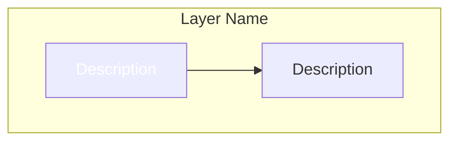

# Agent Prompt: Create Complete Full-Stack Architecture Mermaid Diagram

## Mission

Create a **top-level, Reddit-ready Mermaid diagram** that showcases the complete architecture of a production-ready full-stack AI platform. The diagram should be impressive, comprehensive, and safe to share publicly (no proprietary business logic or secrets).

## Context: What You're Diagramming

A **Restaurant Intelligence SaaS Platform** with 5 core modules:
1. Review Analysis (competitive intelligence)
2. Invoice Processing (price tracking)
3. Menu Management (COGS calculation)
4. Menu Comparison (competitive positioning)
5. Price Analytics (trend forecasting)

## Requirements

### 1. Architecture Layers to Include

**Frontend Layer**
- React 18 + TypeScript + Vite
- TailwindCSS + Shadcn UI
- Zustand (auth state)
- React Query (data fetching)
- 20 pages total
- Real-time SSE streaming

**API Gateway Layer**
- FastAPI (Python 3.14)
- 7 route groups: Auth, Analysis, Streaming, Invoices, Menus, Menu Comparison, Analytics
- 4 middleware: Security Headers, CORS, Auth, Rate Limiting
- Health checks + CSP reporting

**Security Layer** (CRITICAL - Show This Prominently)
- HTTPOnly Cookies (SameSite=Lax)
- JWT Authentication (HS256)
- Content Security Policy (CSP)
- X-Frame-Options, HSTS, X-Content-Type-Options
- ClamAV Malware Scanning
- Row Level Security (RLS)
- Rate Limiting (tier-based)
- Error Sanitization
- Ownership Validation

**Service Layer**
- 40+ services organized by domain
- File Processing: Validator, Malware Scanner, Duplicate Detector
- LLM Services: Free Tier, Enhanced, Premium, Invoice Parser, Menu Parser
- Data Services: Fuzzy Matcher, Unit Converter, Price Analytics, Vendor Mapper
- Storage Services: Invoice, Menu, Analysis, Menu Comparison
- Security Services: Error Sanitizer, Ownership Validator
- Monitoring: Invoice Monitor, Performance Profiler, Event Bus

**AI/LLM Layer**
- Google Gemini 2.0 Flash (Vision + Text)
- 5 LLM services with different capabilities
- Structured prompts with JSON schema enforcement
- Real-time streaming responses

**Data Layer**
- Supabase PostgreSQL (23 tables)
- Redis Cache (rate limiting + sessions)
- Supabase Storage (invoices + menus buckets)
- Row Level Security (RLS) policies
- 10+ database functions
- 20+ indexes

**External APIs Layer**
- Google Gemini API (LLM processing)
- Google Places API (competitor discovery)
- SerpAPI (premium review fetching)
- Outscraper (review scraping)

### 2. Key Flows to Visualize

**Authentication Flow**
1. User logs in → Supabase Auth
2. Backend generates JWT
3. JWT stored in HTTPOnly cookie
4. Every request validated via middleware
5. RLS enforces data access

**Real-Time Streaming Flow (SSE)**
1. User uploads file (invoice/menu)
2. File validated + malware scanned
3. Stored in Supabase bucket
4. Gemini Vision AI parses
5. Progress streamed via SSE
6. Results saved to database
7. Frontend updates in real-time

**Review Analysis Flow**
1. User enters restaurant + location
2. Google Places discovers competitors
3. Reviews fetched (Google/SerpAPI/Outscraper)
4. Gemini AI analyzes reviews
5. Insights generated (threats/opportunities)
6. Evidence reviews linked
7. Results displayed with proof quotes

**Tier-Based Access Control**
1. Request hits rate limiter
2. User tier checked (free/premium/enterprise)
3. Usage limits validated (atomic DB operation)
4. Request allowed/denied
5. Usage incremented if allowed

### 3. Visual Design Guidelines

**Color Coding** (use these hex colors):
- Frontend: `#4F46E5` (Indigo)
- Backend/API: `#10B981` (Green)
- AI/LLM: `#F59E0B` (Amber)
- Database: `#3B82F6` (Blue)
- Security: `#EF4444` (Red)
- External APIs: `#06B6D4` (Cyan)
- Caching: `#8B5CF6` (Purple)

**Node Styling**:
```mermaid
style NodeName fill:#hexcolor,stroke:#darkerhex,stroke-width:3px,color:#fff
```

**Subgraph Organization**:
- Use subgraphs for each layer
- Clear labels with emojis (🎨 Frontend, ⚡ Backend, 🤖 AI, 💾 Data, 🔒 Security)
- Logical grouping within subgraphs

**Connection Types**:
- Solid arrows (`-->`) for primary data flow
- Dashed arrows (`-.->`) for security/monitoring
- Thick arrows for critical paths

### 4. What to Highlight

**Security Features** (make these stand out):
- HTTPOnly cookies
- CSP headers
- RLS policies
- Malware scanning
- Rate limiting
- Error sanitization

**Real-Time Features**:
- SSE streaming
- Progress updates
- Live dashboards

**AI Integration**:
- Gemini 2.0 Flash
- Vision + Text models
- Structured output

**Scalability**:
- Redis caching
- Async processing
- Event bus
- Database functions

### 5. What NOT to Include

❌ Specific business logic (pricing algorithms, prompt templates)
❌ API keys or secrets
❌ Exact database queries
❌ Proprietary algorithms
❌ Customer data or examples
❌ Internal tool names or processes

### 6. Diagram Structure

**Recommended Layout**: Top-to-bottom flow

```
[Client Browser]
    ↓
[Security Layer - Browser]
    ↓
[Frontend - React]
    ↓
[Network - CORS/HTTPS]
    ↓
[API Gateway - FastAPI]
    ↓
[Middleware Stack]
    ↓
[Route Groups] ← [Rate Limiting] ← [Redis]
    ↓
[Service Layer]
    ↓
[AI/LLM Layer] → [External APIs]
    ↓
[Data Layer - Supabase]
    ↓
[Storage Layer]
```

### 7. Key Metrics to Show (Optional)

- 5 Core Modules
- 23 Database Tables
- 40+ Services
- 7 Route Groups
- 4 Middleware Layers
- 20 Frontend Pages
- 3 Subscription Tiers

### 8. Output Format

**File Name**: `diagrams/COMPLETE_ARCHITECTURE_TOP_LEVEL.mmd`

**Structure**:


**Caption File**: `diagrams/COMPLETE_ARCHITECTURE_CAPTION.md`
- Include a Reddit-ready caption
- Highlight key tech choices
- Mention challenges overcome
- Keep it humble but impressive

### 9. Success Criteria

✅ Diagram renders correctly in Mermaid Live Editor
✅ All 7 layers clearly visible
✅ Security features prominently displayed
✅ Real-time streaming flow shown
✅ Tier-based access control illustrated
✅ Color-coded and visually appealing
✅ No proprietary information exposed
✅ Suitable for LinkedIn, Twitter, Reddit
✅ Demonstrates technical depth
✅ Shows modern best practices

### 10. Reference Files

**Read these files for complete context**:
- `FULL_STACK_AUDIT_SUMMARY.md` - High-level overview
- `diagrams/30_full_stack_architecture.mmd` - Existing diagram (improve on this)
- `diagrams/31_complete_infrastructure_security.mmd` - Security focus (merge concepts)
- `api/main.py` - API structure
- `api/middleware/auth.py` - Auth flow
- `api/middleware/security_headers.py` - CSP implementation
- `database/production_schema_complete.sql` - Database schema
- `frontend/src/App.tsx` - Frontend routing

### 11. Bonus Points

🌟 Show the complete request lifecycle (browser → database → response)
🌟 Illustrate tier-based feature gating
🌟 Highlight atomic operations for usage limits
🌟 Show SSE streaming in action
🌟 Include health check endpoints
🌟 Demonstrate error handling flow
🌟 Show RLS policy enforcement

## Deliverables

1. **Main Diagram**: `diagrams/COMPLETE_ARCHITECTURE_TOP_LEVEL.mmd`
2. **Caption**: `diagrams/COMPLETE_ARCHITECTURE_CAPTION.md`
3. **Export Instructions**: How to export for social media

## Example Caption (for inspiration)

```markdown
# Complete Architecture: Restaurant Intelligence Platform

Built a production-ready SaaS platform with 5 core modules, real-time AI processing, and enterprise-grade security.

## Tech Stack
- Frontend: React 18 + TypeScript + TailwindCSS
- Backend: FastAPI + Python 3.14
- Database: Supabase PostgreSQL (23 tables)
- AI: Google Gemini 2.0 Flash (Vision + Text)
- Caching: Redis
- Security: HTTPOnly cookies, CSP, RLS, ClamAV

## Key Features
- Real-time SSE streaming for AI processing
- Tier-based access control (free/premium/enterprise)
- Atomic usage limit enforcement
- Row Level Security on all user data
- Malware scanning on all uploads
- 40+ microservices

## Challenges Overcome
- 8 hours debugging HTTPOnly cookie auth across domains
- Race conditions in usage limit checks (solved with atomic DB functions)
- CSP configuration for Google Fonts + external APIs
- Fuzzy matching for invoice parsing (95%+ accuracy)

## What I Learned
- FastAPI middleware ordering matters
- Supabase RLS is powerful but tricky
- SSE is better than WebSockets for one-way streaming
- Redis is essential for rate limiting at scale

#WebDev #FullStack #AI #FastAPI #React #PostgreSQL #SaaS
```

---

**Now go create the most impressive, comprehensive, Reddit-ready architecture diagram possible!** 🚀
